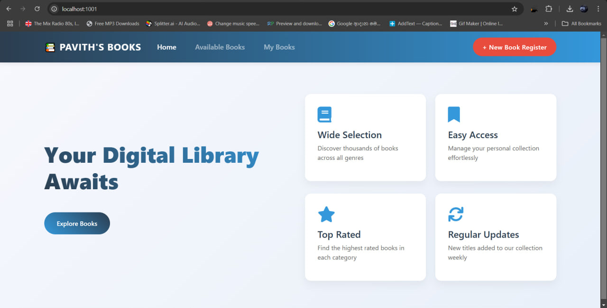
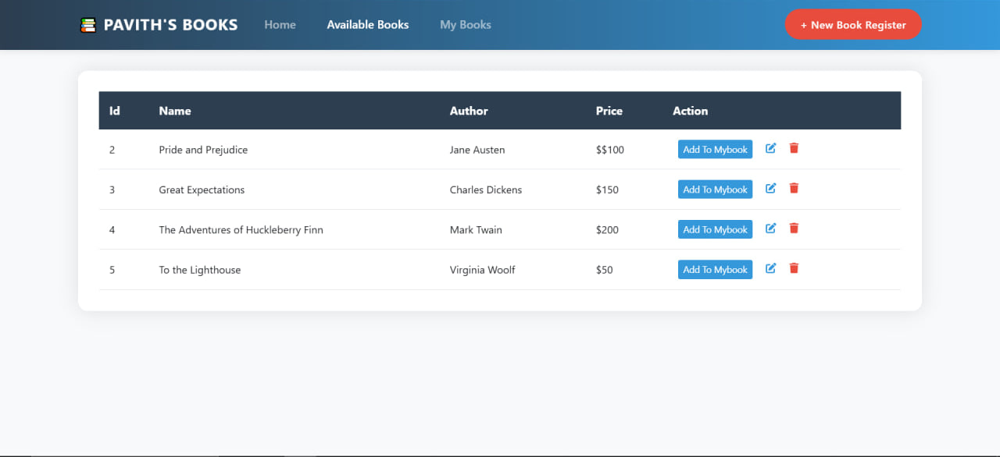

# 📚 Pavith's Book Store

A modern web application for managing a digital book store, built with Spring Boot and Thymeleaf.


## ✨ Features

- **Book Management**: Add, edit, and delete books from the store
- **Personal Book List**: Create and manage your personal collection
- **Modern UI**: Clean and responsive design with Bootstrap 5
- **Database Integration**: Persistent storage with JPA/Hibernate
- **RESTful Architecture**: Well-structured Spring MVC design

## 🚀 Quick Start

### Prerequisites

- Java 17 or higher
- Maven
- MySQL database

### Installation

1. Clone the repository
```bash
git clone https://github.com/yourusername/book-store.git
cd book-store
```

2. Configure database
```properties
# Update application.properties with your database credentials
spring.datasource.url=jdbc:mysql://localhost:3306/bookstore
spring.datasource.username=your_username
spring.datasource.password=your_password
```

3. Build and run
```bash
mvn clean install
mvn spring:boot run
```

4. Visit `http://localhost:1001` in your browser

## 🏗️ Architecture

### Backend
- **Spring Boot**: Core framework
- **Spring MVC**: Web layer
- **Spring Data JPA**: Data access
- **Hibernate**: ORM tool

### Frontend
- **Thymeleaf**: Server-side templating
- **Bootstrap 5**: Responsive design
- **Custom CSS**: Enhanced styling
- **Font Awesome**: Icons

## 📸 Screenshots

<p align="center">
  
  
</p>


## 🌟 Features in Detail

### Book Management
- Add new books with title, author, and price
- View all available books in a responsive table
- Edit existing book details
- Remove books from the store

### Personal Collection
- Add books to personal reading list
- View personal collection
- Remove books from personal list
- Track reading progress

### User Interface
- Modern and responsive design
- Intuitive navigation
- Clean and organized layout
- Consistent styling across pages

## 🛠️ Technology Stack

- **Backend**: Java, Spring Boot
- **Frontend**: HTML, CSS, JavaScript, Thymeleaf
- **Database**: JPA/Hibernate
- **UI Framework**: Bootstrap 5
- **Icons**: Font Awesome
- **Build Tool**: Maven

## 📝 License

This project is licensed under the MIT License - see the [LICENSE.md](LICENSE.md) file for details.


